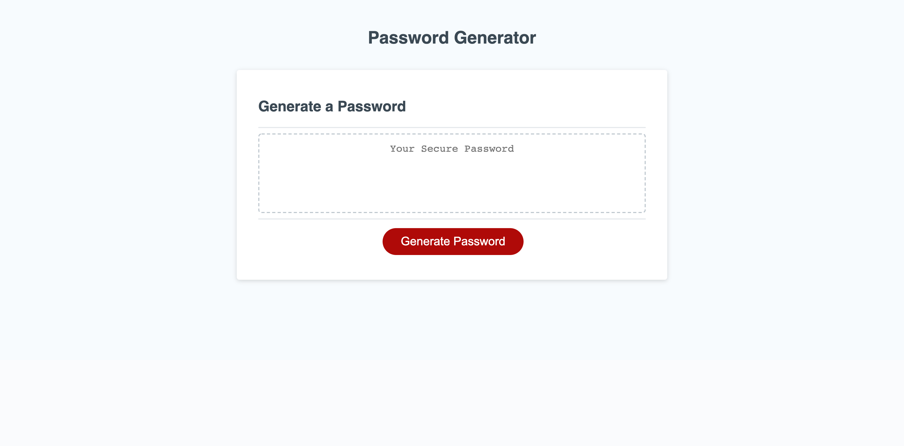

# Password Generator
Challenge 3 of the coding bootcamp, a password generator.

## What is this project about?
This project is for a random password generator. The user is prompted with what characteristics they want their password to have, such as character length, letters, numbers and special values. Once they have chosen their selected criteria, their randomly generated password will appear on the screen.

## How do I use this?
To use, simply click the button on the screen. Enter your desired character length, and when prompted press "OK" to confirm if you want that character type, or "Cancel" if you don't want that character type. 
-For example, if you want Uppercase letters, you will press OK when prompted. If you don't want Uppercase letters, press CANCEL when prompted.
After all of the prompts have been answered, a password with the characteristics the user chose will appear on the screen.

## Why did I make this project?
This was the third challenge in our bootcamp that we had to complete. At this point in the bootcamp, this had been the most difficult project but I had fun figuring out how to make it work. Even if that meant starting from scratch a few tiems.

## Where can i find this project?
https://mmlawton15.github.io/challenge-three-toucan/

## What does this project look like?
